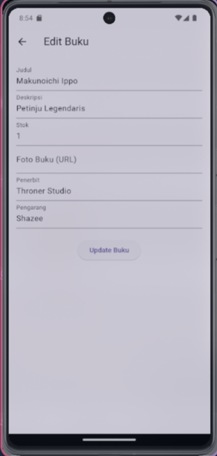

# Perpustakaan Online

Sebuah Perpustakaan Online Berbasis Flutter

## Deskripsi Home Page
Di Home, disini saya memiliki desain home seperti dibawah ini, dibagian home terdapat fitur tambah buku, di page tambah buku akan seperti ini.

### Home Page

## Deskripsi Add Book Page
Di Page ini, kita bisa menambahkan buku dengan inputan Judul, Deskripsi, Stok, URL Gambar, Penerbit Dan Pengarang

### Add Book Page

## Deskripsi Edited Home Page
Di Page ini, kita bisa melihat hasil dari kita menambah buku dari Add Book Page

### Edited Home Page

## Deskripsi Edit Book Page
Di Page ini, kita bisa mengedit isi dari buku yang telah kita tambahkan 

### Edit Book Page

## Deskripsi Delete And Edit Fitur Page
Di fitur ini, kita bisa mengedit dan menghapus isi dari buku yang ada, namun disini saya mencoba menghapus

### Delete Book

